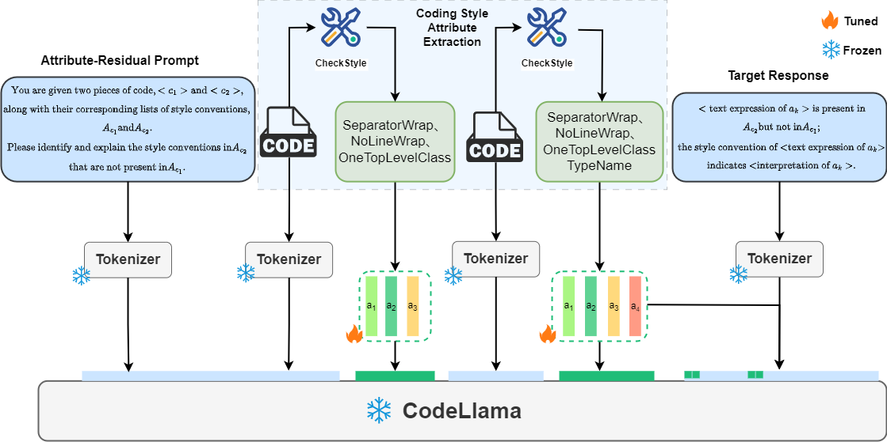

# Multi-user Personalized Code Generation
Multi-user Personalized Code Generator with Explicit and Implicit Representation Learning

## Multi-user Personalized Code Generator
a novel approach named MPCoder, which is designed to generate personalized code for multiple users according to their individual coding styles. 

MPCoder utilizes explicit coding style learning to capture the syntax style standards pre-defined by industry and implicit coding style learning to capture the semantic style that is learned from the code itself.



## Installation
Git clone our repository and creating conda environment:
```
conda create -n link python=3.8
conda activate link
pip install -e
```
## Prepare CodeLlama Weights
Please download the pre-trained [CodeLlama-7b-Instruct-hf](https://huggingface.co/codellama/CodeLlama-7b-Instruct-hf) weights from huggingFace
## Train
```
bash ./StylePrompt/run.sh
```
## Inference
```
bash ./StylePrompt/predict.sh
```